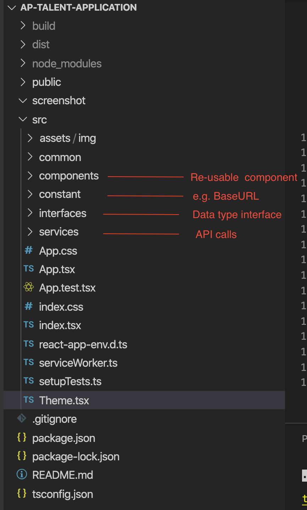

# react-multi-steps-form
# A sample applicaiton of multi-steps registration form using React, Node.js and Material UI.

## Table of Content

- [1. Quick Start](#QuickStart)
- [2. Main Feature](#MainFeature)
- [3. Application Strucure](#ApplicationStrucure)
- [4. Environment Variables](#EnvironmentVariables)

This project was bootstrapped with [Create React App](https://github.com/facebook/create-react-app).
<a name="QuickStart"></a>

## 1. Quick Start

This application has two parts

### 1.1 Back-end Restful API

Back-end API is built using Node.js, to simplify the development, data is saved in json files instead of database. <br />

To start Back-end server, run <br />

#### `npm run server`

It will start the back-end server on port 3030. You can view it on [http://localhost:3030](http://localhost:3030)

### 1.2 Front-end React.js

To run the app in the local development mode.<br />

#### `npm start`

Open [http://localhost:3000](http://localhost:3000) to view it in the browser.

The page will reload if you make edits.<br />

#### `npm run build`

Builds the app for production to the `build` folder.<br />
It correctly bundles React in production mode and optimizes the build for the best performance.

The build is minified and the filenames include the hashes.<br />
Your app is ready to be deployed!

See the section about [deployment](https://facebook.github.io/create-react-app/docs/deployment) for more information.

<a name="MainFeature"></a>

## 2. Main Feature

### 2.1 Responsive

The form is reponsive, below is how it looks like on mobile and desktop/tablet

Mobile View


Desktop View


### 2.2 Client Side Validation


### 2.3 Exception Handling

For any unhandled exception, we show the screen below:


<a name="ApplicationStrucure"></a>

## 3. Application Strucure

### 3.1 Folder structure



### 3.3 Application flow

The application forms contain 12 steps, which are defined in constant/constants.tsx.

```javascript
export enum FormSteps {
  Welcome = 1,
  PersonalDetails = 2,
  Skills = 3,
  Experience = 4,
  Qualifications = 5,
  Certificates = 6,
  Licences = 7,
  SocialMedia = 8,
  PhotoUpload = 9,
  VideoUpload = 10,
  TermsandConditions = 11,
  ThankYou = 12,
}
```

Number of each step indicates the order, e.g. if you want to swap the order of Skills page and Experience page, simply change the number to

```javascript
  Skills = 4,
  Experience = 3,
```

You can find correspondent componet for each step in components folder.


components\UserForm\UserForm.tsx is the glue for all steps.

The first step of the appication is defined in state.step. In the sample code below, it defines Welcome page as the first step.

You can easily change this to any step defined in FormSteps enum, it is very useful when debug a particular step.

```javascript
 state = {
   step: FormSteps.Welcome,
   openModal: false,
   modalType: ModalTypes.ERROR,

   ...

 };
```

The process of each step is defined in nextStep function

```javascript
nextStep = (nextStep: FormSteps = null) => {
   const { step } = this.state;

   switch (step) {
     case FormSteps.Welcome:
       this.setState({
         step: step + 1,
       });

       break;

     case FormSteps.PersonalDetails:
       let formdataPD: FormData = this.constructPersonalDetailsFD();

       if (this.state.uuid.length > 0) {
         saveDataService
           .updateFormDataService(
             formdataPD,
             'multipart/form-data',
             this.state.uuid,
             this.state.email
           )
           .then(() => {
             this.goNextStep(nextStep);
           })
           .catch(() => {
             this.openErrorModal();
           });
       } else
         saveDataService
           .postFormDataService(formdataPD)
           .then((res: any) => {
             this.setState({ uuid: res.talentApplication.uuid });
             this.goNextStep(nextStep);
           })
           .catch(() => {
             this.openErrorModal();
           });

       break;

     case FormSteps.Skills:
       let obj = this.constructSkills();

       saveDataService
         .updateFormDataService(
           obj,
           'application/json',
           this.state.uuid,
           this.state.email
         )
         .then(() => {
           this.goNextStep(nextStep);
         })
         .catch(() => {
           this.openErrorModal();
         });

       break;

     case FormSteps.Experience:
       ...
       break;

     case FormSteps.Qualifications:
       ...
       break;

     case FormSteps.Certificates:
       ...
       break;

     case FormSteps.Licences:
       ...
       break;

     case FormSteps.SocialMedia:
       ...
       break;

     case FormSteps.PhotoUpload:
       ...
       break;

     case FormSteps.VideoUpload:
       ...
       break;

     case FormSteps.TermsandConditions:
       ...
       break;

     default:
   }
 };
```

<a name="EnvironmentVariables"></a>

## 4. Environment Variables

There are serveral environment variables:

- .env: This is default environment variable
- .env.development: This is environment variable for development computer, it is used when run "npm start"
- .env.staging: This is environment variable for staging server
- .env.production: This is environment variable for production server

To run staging build, use the command line "npm run build:staging"

To run production build, use the command line "npm run build"
